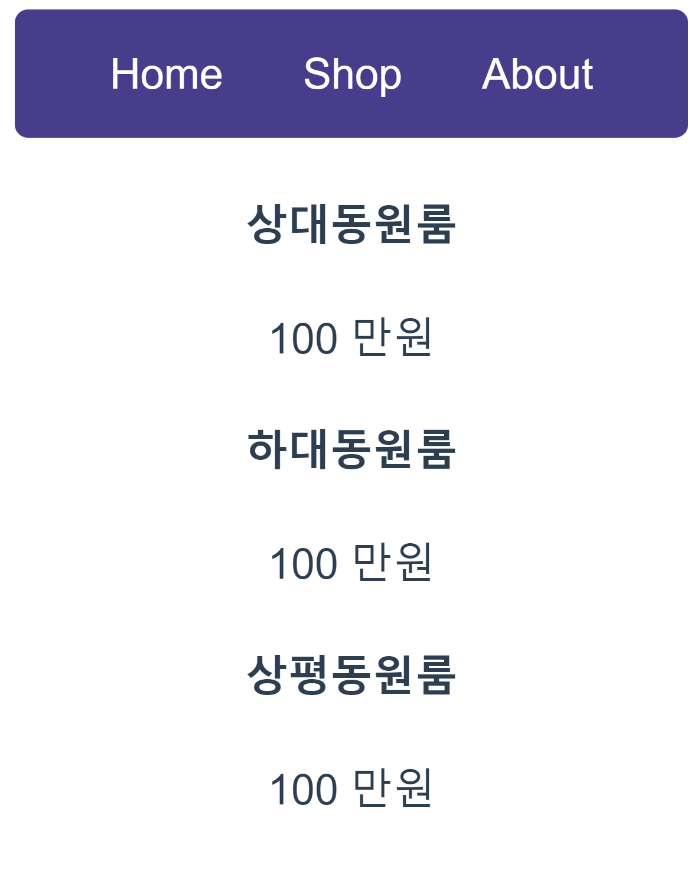

# 문법  
## 데이터 바인딩
  - {{데이터바인딩}}
  - 데이터를 HTML에 꽂아넣는 문법
  - 데이터 보관함부터 있어야함. (데이터 보관함에서 꺼내옴)
    ```html       
    <script>
        export default {
        name: "App",
        data() {
            return {
            price1 : 60,
            };
        },
        components: {},
        };
    </script>
    ```
  - HTML 태그에 포함시키면 보관함에서 알아서 가져와서 출력해줌
    ```html  
    <div>
        <h4 >{{ price1 }}</h4>
        <p > 100 만원</p>
    </div>
    ```
    
    <br>    <br>
  - 데이터 바인딩 이유
    1. 하드코딩시 추후 변경 문제
    2. Vue의 실시간 자동 렌더링
    3. 자주쓰는 데이터는 데이터에 저장해놓았다가 빼내어서 씀
    4. HTML 속성도 데이터바인딩 가능(CSS) >> :속성="데이터이름"
    5. 배열로 빼올 수도 있음
    
## v-for 
  - 기본 문법 : v-for ="작명 in 몇회(배열,객체 가능)" :key=""  

    ``` html  

    <div class="menu">
    <a v-for="(작명,i) in 메뉴들" :key="i"> {{ 작명 }}</a>
    </div>
    
    ```  

  - key는 반복문 돌린 요소를 컴퓨터가 구분하기 위해서 씀.
  - 변수 작명 2개 까지 가능(왼쪽은 Array내 데이터, 오른쪽 변수는 1씩 증가하는 정수)

## event handler
  - HTML 클릭시 코드를 실행하는 방법
  - v-on:click ="자바스크립트"
  - @click="함수명()" (축약 문법, 다른 이벤트도 사용가능함)
  - JS코드가 길어지면 함수를 추가로 만들어서 설정도 가능
    - methods: {함수(){}}안에 만들면 됨
    - 함수 안에서 데이터 사용시, this.데이터명으로 사용<br>  

 - 뭘 만들때 데이터를 어떻게 만들지 먼저 생각해야함(기획)
## v-if
  - v-if="조건식"
## import/export
  - 하위 모듈
  - var 변수명 = 0;
  - export default 변수명  
  - export default {변수명1, 변수명2}

  - 상위 모듈
  - import 아무글자 from '경로'
  - import {변수명1, 변수명2} from '경로'
  

## 모달 창 만들기
  data(){} 이 부분을 프론트에선 state라고 부릅니다. 
   -> 데이터를 저장하기도 하지만 UI의 상태를 저장하기도 하기 때문에!
  - 동적인 UI 만드는법
    1. UI의 현재 상태를 데이터로 저장
    2. 데이터에 따라 UI가 어떻게 보일지 작성 