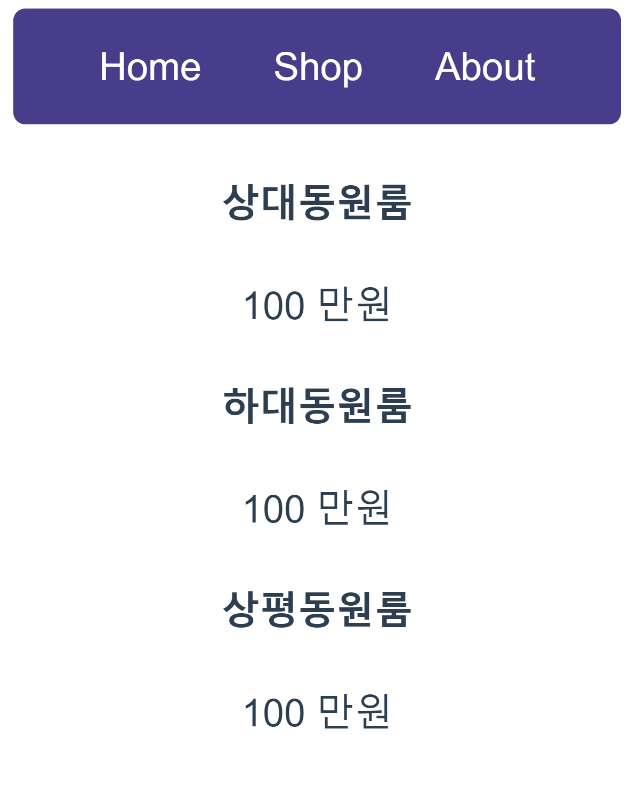
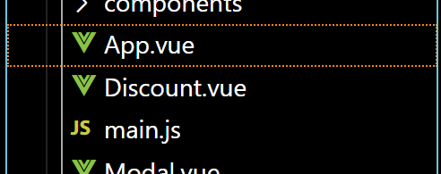

# 문법  
## 데이터 바인딩
  - {{데이터바인딩}}
  - 데이터를 HTML에 꽂아넣는 문법
  - 데이터 보관함부터 있어야함. (데이터 보관함에서 꺼내옴)
    ```html       
    <script>
        export default {
        name: "App",
        data() {
            return {
            price1 : 60,
            };
        },
        components: {},
        };
    </script>
    ```
  - HTML 태그에 포함시키면 보관함에서 알아서 가져와서 출력해줌
    ```html  
    <div>
        <h4 >{{ price1 }}</h4>
        <p > 100 만원</p>
    </div>
    ```
    
    <br>    <br>
  - 데이터 바인딩 이유
    1. 하드코딩시 추후 변경 문제
    2. Vue의 실시간 자동 렌더링
    3. 자주쓰는 데이터는 데이터에 저장해놓았다가 빼내어서 씀
    4. HTML 속성도 데이터바인딩 가능(CSS) >> :속성="데이터이름"
    5. 배열로 빼올 수도 있음
    
## v-for 
  - 기본 문법 : v-for ="작명 in 몇회(배열,객체 가능)" :key=""  

    ``` html  

    <div class="menu">
    <a v-for="(작명,i) in 메뉴들" :key="i"> {{ 작명 }}</a>
    </div>
    
    ```  

  - key는 반복문 돌린 요소를 컴퓨터가 구분하기 위해서 씀.
  - 변수 작명 2개 까지 가능(왼쪽은 Array내 데이터, 오른쪽 변수는 1씩 증가하는 정수)

## event handler
  - HTML 클릭시 코드를 실행하는 방법
  - v-on:click ="자바스크립트"
  - @click="함수명()" (축약 문법, 다른 이벤트도 사용가능함)
      ```html
          <button @click="모달창열렸니 = false">x</button>
      ```
  - JS코드가 길어지면 함수를 추가로 만들어서 설정도 가능
    - methods: `{함수(){}}`안에 만들면 됨
    - 함수 안에서 데이터 사용시, this.데이터명으로 사용<br>  


 - 뭘 만들때 데이터를 어떻게 만들지 먼저 생각해야함(기획)
## v-if
  - v-if="조건식" v-else-if="조건식", v-else="조건식"
    ```html
    <div v-if="3==1">
        hi
    </div>

    <!-- 위의 조건이 거짓이고 아래조건이 참이면 실행 -->
    <div v-else-if="3==2">
        hi
    </div>

    <!-- 위 두 조건이 다 거짓이면실행 -->
    <div v-else="3==3">
        hi
    </div> 
    
    ```
## import/export
  - 하위 모듈
    ```javascript
    var 변수명 = 0;
    export default 변수명  
    export default {변수명1, 변수명2} // 두번째 방법
    ```

  - 상위 모듈
    ```javascript
    import 아무글자 from '경로'
    import {변수명1, 변수명2} from '경로' //두번째 방법
    ```
  


## Component

컴포넌트 분리 방법
  1. 관련 vue 파일을 먼저 생성
  
  2. App.vue 파일과 같은 구조로 전체 구조 잡은 뒤, 탬플릿 부분에 넣을 컴포넌트 삽입 후, 스크립트에 이름 설정(2단어조합, 카멜)
     - 싫다면 아래 코드를 package.json에 추가해준다.
        ```json
        "rules": {
          "vue/multi-word-component-names": "off"
        } 
        ``` 
      ```html
      <template>
        <div class="discount">
          <h4>지금 결제하면 20% 할인</h4>
        </div>
      </template>

      <script>
      export default {
        name: 'DiscountBanner',
      };
      </script>

      <style>
      </style>
      ```
  3. App.vue파일에 작성한 파일을 임포트 해준 후 component에 추가해준다.
   ```html
    <script>
      import oneroomsdata from "./assets/oneroom";
      import Discount from "./Discount.vue";
      import Modal from "./Modal.vue";

      export default {
        name: "App",

        data() {
          return {
            clicked: 0,
            onerooms: oneroomsdata,
            modal: false,
            menu: ["Home", "Shop", "About"],
          };
        },
        created() {},
        methods: {},
        components: {
          Discount,
          Modal
        },
      };
    </script>
   ```
  4. App.vue 파일의 Template 부분에 추가해준다.
   ```html
    <template>
      생략...
       <Discount/>
      생략...
    </template>
   ```
  5. 하나의 페이지를 하나의 컴포넌트로 만드는 게 좋음
  6. 단, 컴포넌트에서 부모의 data를 참조(데이터바인딩)하기 위해서는 props로 보내야함


## Porps

  1. 보내고
  ```html
    <Modal :clicked="clicked" :onerooms="onerooms" :modal="modal"/>
  ```
  2. 등록하고
   ```html
    <script>
    export default {
        name: 'ModalCard',
        props:{
            clicked : Object,
            onerooms: Array,
            modal: Boolean,
            
        }
    }
    </script>
   ```
  3. 쓰기
   ```html
  <template>
    <div class="black-bg" v-if="modal == true">
      <div class="white-bg">
        
        <h4>{{ onerooms[clicked].title }}</h4>
        <p>{{ onerooms[clicked].content }}</p>
        <p>{{ onerooms[clicked].price }} 원</p>
        <Discount />
        <!-- <button @click="modal = false">x</button> -->
      </div>
    </div>
  </template>
   ```
   - 데이터를 만들기 전에  
    데이터를 사용하는 컴포넌트들 중 최상위 컴포넌트에다 데이터를 만들어놔야함!