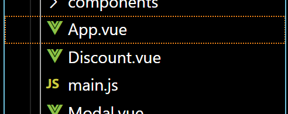

## Component

컴포넌트 분리 방법
  1. 관련 vue 파일을 먼저 생성
  
  2. App.vue 파일과 같은 구조로 전체 구조 잡은 뒤, 탬플릿 부분에 넣을 컴포넌트 삽입 후, 스크립트에 이름 설정(2단어조합, 카멜)
     - 싫다면 아래 코드를 package.json에 추가해준다.
        ```json
        "rules": {
          "vue/multi-word-component-names": "off"
        } 
        ``` 
      ```html
      <template>
        <div class="discount">
          <h4>지금 결제하면 20% 할인</h4>
        </div>
      </template>

      <script>
      export default {
        name: 'DiscountBanner',
      };
      </script>

      <style>
      </style>
      ```
  3. App.vue파일에 작성한 파일을 임포트 해준 후 component에 추가해준다.
   ```html
    <script>
      import oneroomsdata from "./assets/oneroom";
      import Discount from "./Discount.vue";
      import Modal from "./Modal.vue";

      export default {
        name: "App",

        data() {
          return {
            clicked: 0,
            onerooms: oneroomsdata,
            modal: false,
            menu: ["Home", "Shop", "About"],
          };
        },
        created() {},
        methods: {},
        components: {
          Discount,
          Modal
        },
      };
    </script>
   ```
  4. App.vue 파일의 Template 부분에 추가해준다.
   ```html
    <template>
      생략...
       <Discount/>
      생략...
    </template>
   ```
  5. 하나의 페이지를 하나의 컴포넌트로 만드는 게 좋음
  6. 단, 컴포넌트에서 부모의 data를 참조(데이터바인딩)하기 위해서는 props로 보내야함

